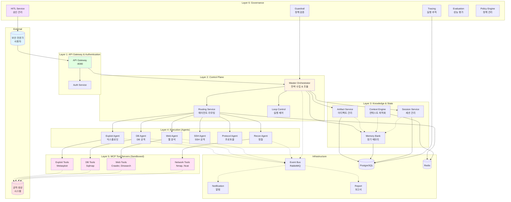
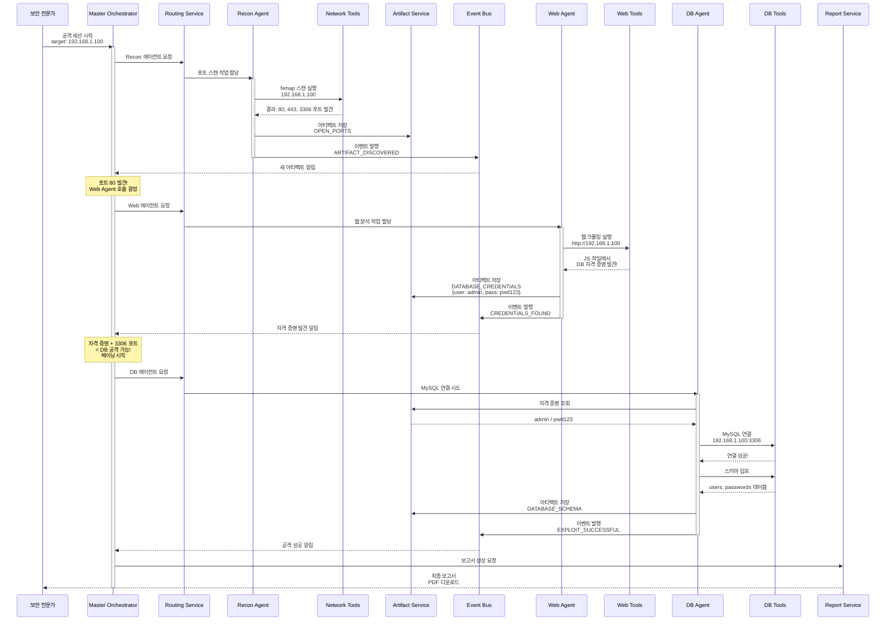
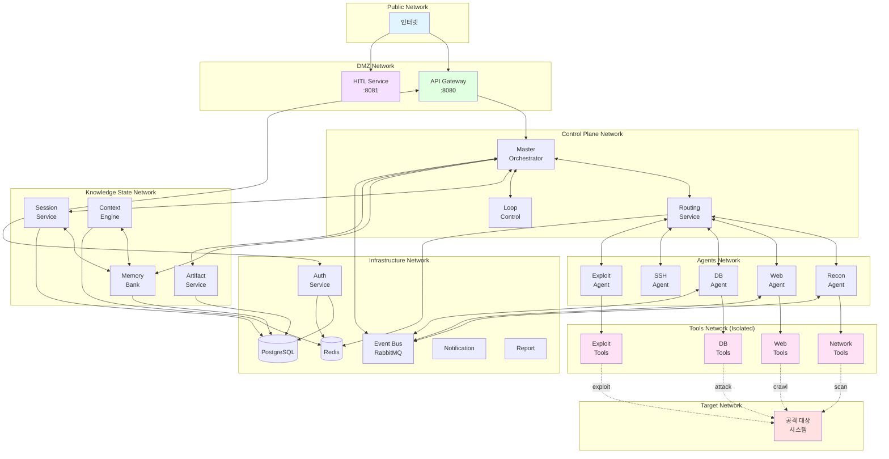
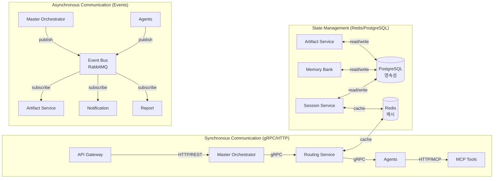
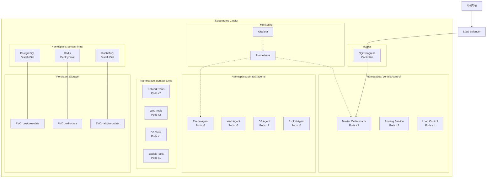

# Multi-Agent Penetration Testing System Architecture Diagrams

## 1. 전체 시스템 아키텍처 (레이어별)

## 2. 취약점 체이닝 데이터 흐름

## 3. 네트워크 토폴로지 (Docker Networks)

## 4. 서비스 간 통신 패턴

## 5. 보안 계층 (Security Layers)

```mermaid
graph TB
    subgraph "Security Layer 1: Authentication & Authorization"
        User[사용자]
        API[API Gateway]
        Auth[Auth Service]

        User -->|JWT Token| API
        API -->|Verify| Auth
    end

    subgraph "Security Layer 2: Policy Enforcement"
        MO[Master Orchestrator]
        GR[Guardrail Service]
        PE[Policy Engine]

        MO -->|Check Policy| GR
        GR -->|Validate| PE
    end

    subgraph "Security Layer 3: Human Approval"
        Agent[Agent]
        HITL[HITL Service]
        Expert[보안 전문가]

        Agent -->|High Risk Action| HITL
        HITL -->|Request Approval| Expert
        Expert -->|Approve/Deny| HITL
    end

    subgraph "Security Layer 4: Network Isolation"
        AgentNet[Agents Network]
        ToolsNet[Tools Network<br/>Isolated]

        AgentNet -->|Controlled Access| ToolsNet
    end

    subgraph "Security Layer 5: Audit & Monitoring"
        TR[Tracing Service]
        EV[Evaluation Service]
        Log[(Audit Logs)]

        TR -->|Record| Log
        EV -->|Analyze| Log
    end

    style User fill:#e1f5ff
    style Expert fill:#e1f5ff
    style ToolsNet fill:#ffe1f5
    style HITL fill:#f5e1ff
```

## 6. 컴포넌트 상세 구조

```mermaid
graph TB
    subgraph "Master Orchestrator 내부 구조"
        MO_API[REST API]
        MO_Engine[Reasoning Engine<br/>Google ADK]
        MO_Strategy[Strategy Planner]
        MO_Coord[Agent Coordinator]
        MO_Event[Event Handler]

        MO_API --> MO_Engine
        MO_Engine --> MO_Strategy
        MO_Strategy --> MO_Coord
        MO_Event --> MO_Engine
    end

    subgraph "Agent 내부 구조 (예: Web Agent)"
        A_API[Agent API]
        A_Logic[Attack Logic]
        A_MCP[MCP Client]
        A_Report[Result Reporter]

        A_API --> A_Logic
        A_Logic --> A_MCP
        A_MCP --> A_Report
    end

    subgraph "MCP Tool Server 내부 구조"
        T_API[MCP API]
        T_Validate[Request Validator]
        T_Exec[Tool Executor<br/>Sandboxed]
        T_Result[Result Formatter]

        T_API --> T_Validate
        T_Validate --> T_Exec
        T_Exec --> T_Result
    end

    subgraph "Artifact Service 내부 구조"
        AR_API[REST API]
        AR_Store[Artifact Store]
        AR_Index[Search Index]
        AR_Chain[Chain Detector]
        AR_Graph[Attack Graph]

        AR_API --> AR_Store
        AR_Store --> AR_Index
        AR_Index --> AR_Chain
        AR_Chain --> AR_Graph
    end
```

## 7. 배포 아키텍처 (Kubernetes)

이 다이어그램들은 Mermaid 형식으로 작성되었습니다!
